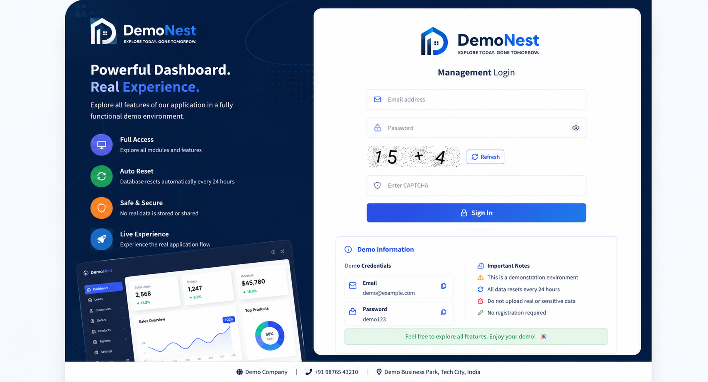
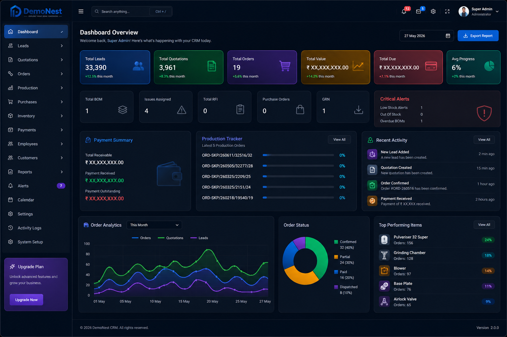
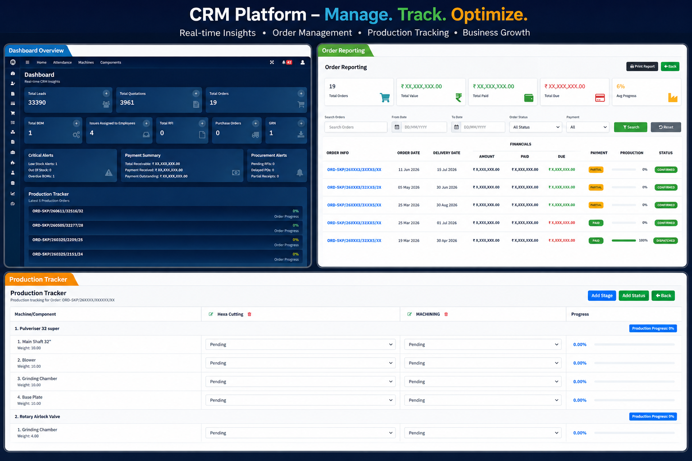

<div align="center">

# 🚀 CRM Management System

### Enterprise CRM Platform for Customer, Sales & Business Operations

A modern and scalable CRM solution built with **Laravel 11** for managing leads, quotations, customers, orders, inventory, payments, production, reports, and business operations from one powerful dashboard.

<p>


</p>

## 🌐 Live Demo

### 🔗 https://crm-demo-production-n5tcyr.laravel.cloud/

Demo Credentials

**Email**

```
test@crmsystem.com
```

**Password**

```
12345678
```

---

</div>

# 📖 Overview

CRM Management System is a production-ready business management platform developed using **Laravel 11**.

The application helps businesses manage their entire workflow, including customer management, lead tracking, quotations, sales orders, inventory, payments, production tracking, reports, user management, and role-based permissions.

The system follows Laravel best practices with a modular architecture, reusable components, and a responsive dashboard suitable for startups, SMEs, and enterprise applications.

---

# 📸 Project Screenshots

## 🔐 Login Page



---

## 📊 Dashboard



---

## 📦 Order Management



---

# ✨ Core Features

## Authentication

- Secure Login
- Password Reset
- CAPTCHA Protection
- Remember Me
- Session Management

---

## Dashboard

- Business Analytics
- Revenue Summary
- Lead Statistics
- Order Overview
- Production Tracker
- Recent Activities
- Payment Summary
- Alerts Dashboard

---

## Lead Management

- Lead Creation
- Lead Assignment
- Lead Tracking
- Duplicate Prevention
- Search & Filters

---

## Customer Management

- Customer Profiles
- Address Management
- Contact Information
- Customer History

---

## Quotation Management

- Create Quotations
- PDF Export
- Taxes & Discounts
- Currency Support
- Print Quotations

---

## Order Management

- Order Creation
- Order Status
- Delivery Tracking
- Production Tracking
- Order Reports

---

## Production Module

- Production Stages
- Progress Tracking
- Machine Assignment
- Completion Status
- Live Progress Updates

---

## Inventory

- Product Management
- Categories
- Brands
- Stock Management
- Low Stock Alerts

---

## Payments

- Payment Records
- Outstanding Amounts
- Transaction History
- Due Tracking

---

## Reports

- Sales Reports
- Lead Reports
- Payment Reports
- Inventory Reports
- Customer Reports

---

## User & Access Control

- User Management
- Roles
- Permissions
- Middleware Protection
- Activity Logs

---

## Website Settings

- Company Information
- Logo Management
- SEO Settings
- Maintenance Mode
- Email Configuration

---

# 🛠 Technology Stack

| Technology | Version |
|------------|----------|
| Laravel | 11 |
| PHP | 8.2+ |
| MySQL | 8+ |
| Bootstrap | 5 |
| JavaScript | ES6 |
| jQuery | Latest |
| Blade | Laravel |
| Font Awesome | Latest |

---

# 📦 Project Modules

- Authentication
- Dashboard
- Leads
- Customers
- Quotations
- Orders
- Production
- Inventory
- Purchases
- Payments
- Employees
- Reports
- Activity Logs
- Role & Permission
- User Management
- Settings
- Maintenance Mode

---

# 📂 Project Structure

```
app/
bootstrap/
config/
database/
public/
resources/
routes/
storage/
tests/
vendor/
```

---

# 🚀 Installation

Clone Repository

```bash
git clone https://github.com/Anujknp1206/CRM-demo.git
```

Move to Project

```bash
cd CRM-demo
```

Install Dependencies

```bash
composer install
```

Install Node Packages

```bash
npm install
```

Copy Environment

```bash
cp .env.example .env
```

Generate Application Key

```bash
php artisan key:generate
```

Configure Database

```
.env
```

Run Migration

```bash
php artisan migrate
```

Seed Database (Optional)

```bash
php artisan db:seed
```

Storage Link

```bash
php artisan storage:link
```

Run Development Server

```bash
php artisan serve
```

Compile Assets

```bash
npm run dev
```

---

# 🔐 Demo Credentials

| Field | Value |
|-------|-------|
| Email | test@crmsystem.com |
| Password | 12345678 |

> ⚠️ This is a demonstration environment. Data resets periodically.

---

# 🚀 Future Enhancements

- REST API
- Mobile Application
- WhatsApp Integration
- Email Automation
- SMS Notifications
- AI Business Analytics
- Multi-Tenant Architecture
- Customer Portal
- Advanced Reports
- Real-time Notifications

---

# 👨‍💻 Developer

## Anuj Yadav

**Backend Developer | Laravel Developer**

- 🌐 GitHub: https://github.com/Anujknp1206
- 💼 LinkedIn: https://www.linkedin.com/in/anujyadav1206
- 📧 Email: anujknp1206@gmail.com

---

# ⭐ Support

If you found this project useful, please consider giving it a ⭐ on GitHub.

It helps others discover the project and motivates future improvements.

---

# 📄 License

This project is licensed under the **MIT License**.